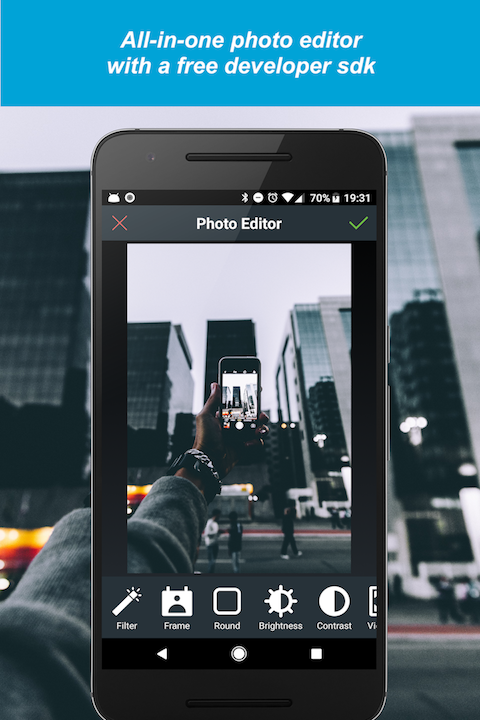
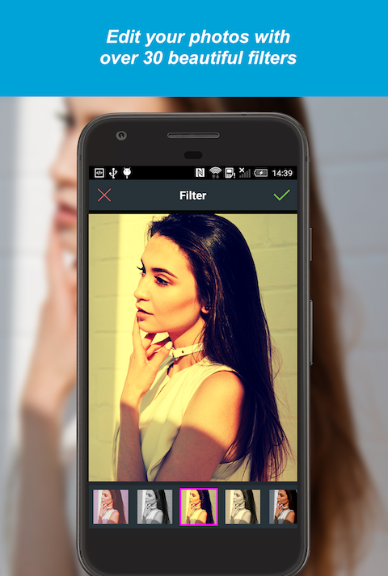
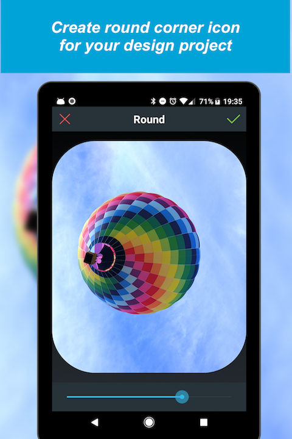

# DS Photo Editor SDK - iOS & Android

DS Photo Editor SDK is an all-in-one photo editor SDK for iOS & Android. And it is 100% free for developers to use!

With DS Photo Editor SDK, you can add a beautiful all-in-one photo editor into your mobile apps within just minutes! It offers powerful photo editing components with a beautiful user interface, which allows your users to transform their photos into works of art and to express their creativity with the world!

Key features in the SDK:
1. Support both phones & tablets
2. HD photo processing with fast image rendering
3. Gorgeous photo filters with one-tap auto enhance
4. Fun stickers & text over the photo
5. Adjust brightness, contrast, color temperature, saturation & exposure
6. Round corner
7. Photo crop with chosen aspect ratio
8. Many bulit-in photo frames
9. Photo vignette & sharpness effects
10. Support all major languages

# Get Started

To get started, please register a free developer account at https://developer.dsphotoeditor.com/login and add your iOS & Android apps in our developer dashboard. Sample code for iOS & Android integration is available for download from the developer dashboard.

SDK documentation with step-by-step instructions can be found here:
Android: https://www.dsphotoeditor.com/android
iOS (Objective-C): https://www.dsphotoeditor.com/ios-objective-c
iOS (Swift): https://www.dsphotoeditor.com/ios-swift

# Screenshots

| | width=360 |  |

# Terms of Service and Privacy Policy

By integrating DS Photo Editor SDK, you agree to our Terms of Service (https://www.dsphotoeditor.com/terms-of-service) and Privacy Policy (https://www.dsphotoeditor.com/privacy-policy). 